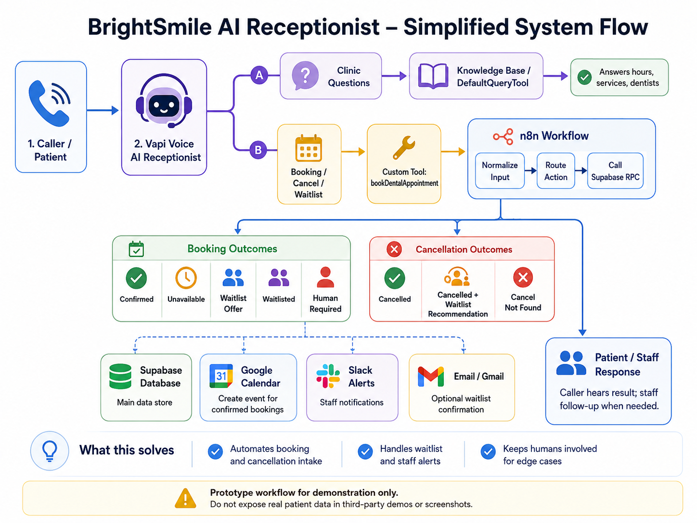
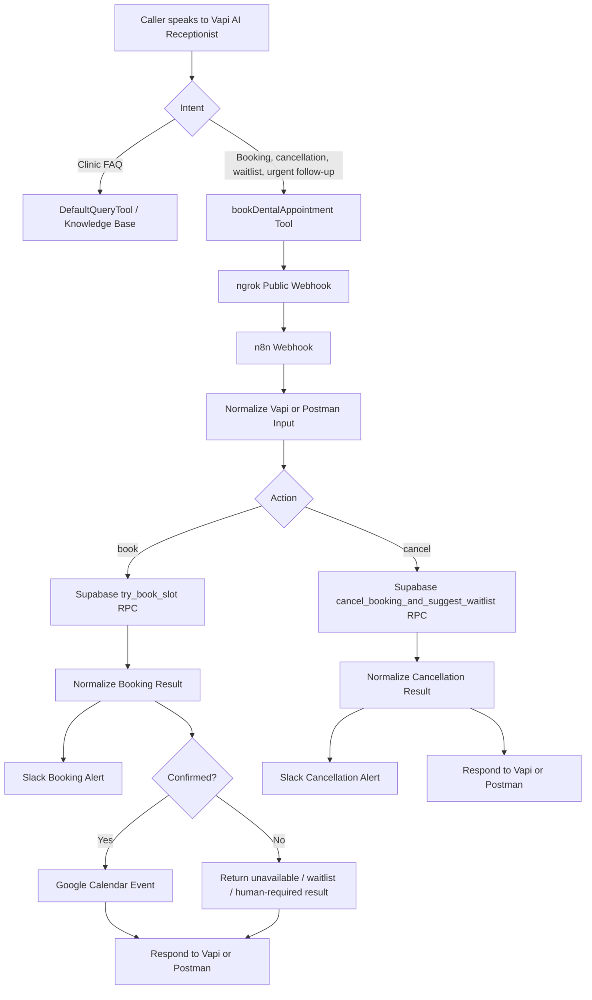
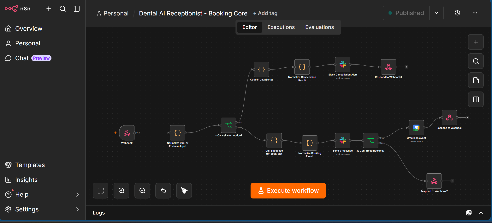
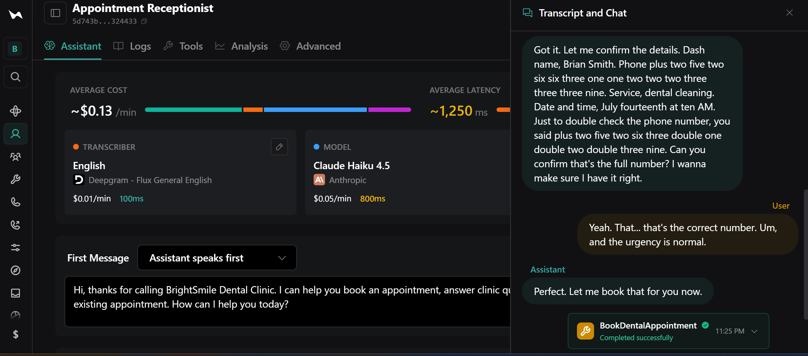
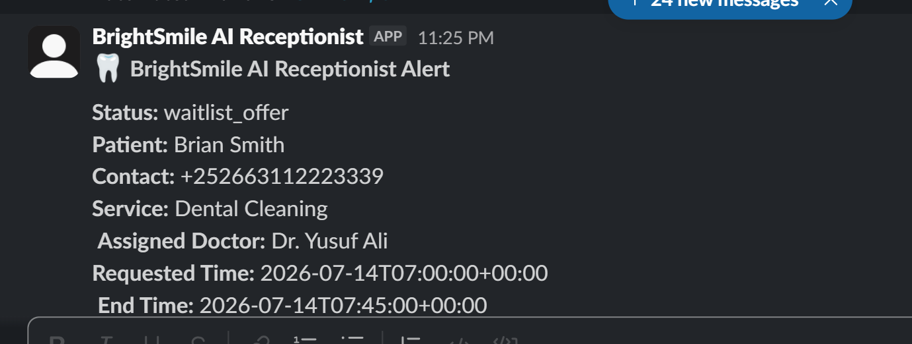
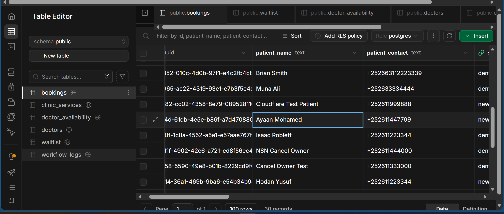
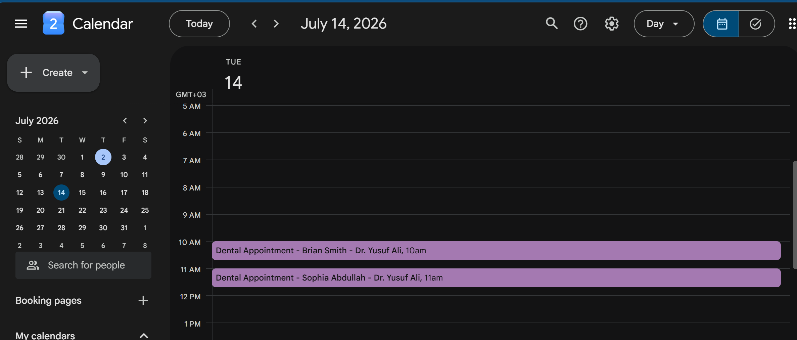

<div align="center">

# 🦷 BrightSmile AI Receptionist

### Voice AI appointment booking, cancellation, waitlisting, staff alerts, and calendar automation for a dental clinic.

<p>
  
  
  
  
  
</p>

**Vapi + n8n + Supabase + Slack + Google Calendar**

[Demo Video Coming Soon](#demo-video) · [Architecture](#architecture) · [Screenshots](#screenshots) · [Setup](#setup-overview)

</div>

---

## Overview

**BrightSmile AI Receptionist** is a prototype voice automation system for a dental clinic. It simulates a real receptionist that can speak with callers, collect appointment details, check scheduling rules, book confirmed appointments, cancel existing appointments, place callers on a cancellation waitlist, notify staff, and create calendar events.

The project is designed as a portfolio-grade AI automation workflow, not just a simple chatbot. The AI assistant does not guess availability. It calls a backend workflow, and the backend decides whether the appointment can be booked, waitlisted, cancelled, or escalated to staff.

---

## What Problem This Solves

Dental clinics often receive repetitive phone calls for:

- Appointment booking
- Appointment cancellation
- “Do you have availability?” questions
- Waitlist requests
- Basic clinic information
- Urgent follow-up requests
- Staff coordination after cancellations

This project shows how an AI receptionist can reduce manual front-desk workload while still keeping staff in control for sensitive or uncertain cases.

The system is useful because it:

- Handles common booking and cancellation calls automatically.
- Prevents double-booking through backend scheduling logic.
- Creates calendar events only after a confirmed booking.
- Adds patients to a cancellation waitlist only after explicit consent.
- Recommends waitlisted patients to staff instead of auto-rebooking them.
- Gives safe fallback responses when external systems fail.
- Keeps the backend database as the source of truth.

---

## Demo Video

> Video walkthrough coming soon.

Planned demo flow:

1. Voice booking through Vapi.
2. n8n workflow execution.
3. Supabase confirmed booking row.
4. Slack staff alert.
5. Google Calendar event.
6. Waitlist request after a taken slot.
7. Cancellation with waitlist recommendation.

<!-- Replace this placeholder when the demo is recorded -->
<!-- Example: https://www.loom.com/share/your-demo-video -->

---

## System Flow



---

## Architecture



---

## Tech Stack

| Layer | Tool | Purpose |
|---|---|---|
| Voice assistant | Vapi | Handles voice conversation and tool calling |
| Workflow automation | n8n | Routes booking, cancellation, waitlist, Slack, and Calendar actions |
| Database | Supabase Postgres | Stores bookings, waitlist, services, doctors, and logs |
| Scheduling logic | Supabase RPC | Validates availability, prevents overlap, handles cancellation and waitlist recommendation |
| Staff notifications | Slack | Alerts clinic staff about bookings, cancellations, and waitlist follow-up |
| Calendar | Google Calendar | Creates events only for confirmed appointments |
| Public webhook | ngrok | Exposes local n8n webhook during development |
| Testing | Postman | Tests backend workflow before voice testing |

---

## Core Features

### 1. Voice Appointment Booking

The caller can say:

> “I want to book a dental cleaning for Tuesday July 14 at 11 AM.”

The assistant collects:

- Patient name
- Patient contact
- Service type
- Appointment date and time
- Urgency level

Then Vapi calls the n8n webhook. n8n sends the request to Supabase, where the scheduling rules are enforced.

A booking is only confirmed if:

- The service exists.
- The doctor is available for that service.
- The appointment is inside clinic hours.
- The appointment is inside the booking window.
- The slot is not already taken.
- The backend returns `status=confirmed`.

---

### 2. Appointment Cancellation

The assistant can cancel a confirmed appointment using:

- `booking_id` when the appointment was just booked in the same voice conversation.
- Patient name, contact, service, and appointment time when the appointment already existed.

Cancellation statuses include:

- `cancelled_no_waitlist_match`
- `cancelled_waitlist_recommended`
- `cancel_not_found`
- `already_cancelled`
- `verification_required`

The assistant does not claim a cancellation succeeded unless the backend confirms it.

---

### 3. Cancellation Waitlist

When a requested slot is unavailable, the assistant can ask:

> “Would you like to join the cancellation waitlist for that time, or choose another appointment time?”

The system only adds the caller to the waitlist after clear consent.

When a confirmed booking is cancelled, the cancellation workflow checks for matching waitlisted patients and recommends one to staff.

Important: the system does **not** automatically rebook the waitlisted patient. Staff review is required.

---

### 4. Staff Alerts

Slack alerts are sent for:

- New booking requests
- Confirmed appointments
- Waitlist entries
- Cancellation requests
- Waitlist recommendations after cancellation
- Human verification cases

This keeps the front desk in the loop instead of hiding automation decisions.

---

### 5. Calendar Creation

Google Calendar events are created only when Supabase returns:

```text
status = confirmed
```

No calendar event is created for unavailable, waitlisted, invalid, or human-required results.

---

### 6. Clinic Knowledge Base

Basic clinic questions are answered through a separate knowledge tool.

Examples:

- Opening hours
- Closed days
- Services
- Dentist schedules
- General clinic information

The knowledge tool is not used to confirm live appointment availability. Availability is handled by Supabase through the booking workflow.

---

## Clinic Scheduling Rules

| Service | Doctor | Available Days | Local Clinic Time |
|---|---|---|---|
| New Patient Consultation | Dr. Amina Hassan | Monday, Wednesday, Friday | 9:00 AM – 1:00 PM |
| Dental Cleaning | Dr. Yusuf Ali | Tuesday, Thursday | 10:00 AM – 3:00 PM |
| Follow-up Appointment | Dr. Omar Farah | Monday – Thursday | 1:00 PM – 5:00 PM |
| Urgent Tooth Pain | Dr. Sara Ahmed | Monday – Friday | 9:00 AM – 5:00 PM |
| General Inquiry | Staff follow-up | Monday – Friday | 9:00 AM – 5:00 PM |

Clinic timezone:

```text
Africa/Nairobi / UTC+03:00
```

The tool receives timestamps in UTC:

```text
Caller says: July 16, 2026 at 2:00 PM clinic time
Tool receives: 2026-07-16T11:00:00+00:00
```

---

## What Changed During Development

This project went through several real debugging and design improvements:

### Problem: Voice AI could send local time directly

At first, the tool parameter description allowed `+03:00` local time. That could cause the backend to read the wrong slot.

**Fix:** Updated the Vapi tool schema and assistant prompt so `requested_start_time` must always be sent as UTC `+00:00`.

---

### Problem: Cancellation could fail because of speech transcription

During voice testing, Vapi misheard or changed a phone number. Supabase correctly returned `cancel_not_found` because the booking details did not match.

**Fix:** Added optional `booking_id` to the Vapi tool schema and included `booking_id` in the n8n response back to Vapi. Same-conversation cancellation can now cancel “that appointment” safely.

---

### Problem: Local Docker-to-Supabase HTTPS calls sometimes failed

During testing, n8n sometimes returned connection errors such as:

```text
ECONNREFUSED
```

**Fix:** Replaced fragile direct HTTP behavior with n8n Code nodes using retry logic for both booking and cancellation RPC calls.

---

### Problem: AI should not fake success

The assistant must not say a booking or cancellation succeeded if the backend failed or returned an unclear result.

**Fix:** Added safe fallback statuses:

- `human_required` for booking verification
- `verification_required` for cancellation verification

The receptionist tells the caller that clinic staff will verify the request instead of pretending the action succeeded.

---

### Problem: Waitlist should not automatically rebook another patient

Automatically assigning a cancelled slot to a waitlisted patient can create privacy and consent problems.

**Fix:** The system only recommends the waitlisted patient to staff. Staff must review and contact the patient manually.

---

## Screenshots

Add screenshots in:

```text
assets/screenshots/
```

Recommended screenshot names:

### n8n Workflow



### Vapi Booking Transcript



### Slack Alert



### Supabase Booking Row



### Google Calendar Event



Optional extra screenshots:

```text
assets/screenshots/vapi-cancellation-transcript.png.pmg
assets/screenshots/vapi-waitlist-transcript.png.png
assets/screenshots/n8n-booking-execution.png.png
assets/screenshots/n8n-cancellation-execution.png.png
assets/screenshots/supabase-waitlist-row.png.png
```

---

## Project Structure

```text
ai-dental-receptionist-workflow/
├── README.md
├── .env.example
├── .gitignore
├── docs/
│   ├── architecture.md
│   ├── setup.md
│   ├── testing.md
│   ├── demo-walkthrough.md
│   └── vapi-prompt.md
├── workflows/
│   └── n8n/
│       └── Dental_AI_Receptionist_Booking_Core_SANITIZED.json
└── assets/
    ├── diagrams/
    │   └── brightsmile-system-flow.png
    └── screenshots/
        ├── n8n-workflow.png.png
        ├── vapi-booking-transcript.png.png
        ├── slack-alert.png.png
        ├── supabase-booking-row.png.png
        └── google-calendar-event.png.png
```

---

## Setup Overview

### 1. Supabase

Create tables for:

- `clinic_services`
- `doctors`
- `doctor_availability`
- `bookings`
- `waitlist`
- `workflow_logs`

Create RPC functions for:

- `try_book_slot`
- `cancel_booking_and_suggest_waitlist`

The database is responsible for enforcing booking rules.

---

### 2. n8n

Import the sanitized workflow from:

```text
workflows/n8n/Dental_AI_Receptionist_Booking_Core_SANITIZED.json
```

Then reconnect:

- Supabase project URL
- Supabase service role key
- Slack credentials
- Google Calendar credentials
- Webhook URL

Do not commit the real configured workflow with secrets.

---

### 3. Vapi

Create a custom tool named:

```text
bookDentalAppointment
```

Use the n8n production webhook URL:

```text
https://your-ngrok-domain/webhook/dental-booking
```

Recommended tool settings:

```text
Timeout: 60 seconds
Async: Off
Strict mode: Off
```

---

### 4. Testing

Test in this order:

1. Supabase SQL/RPC directly.
2. Postman to n8n webhook.
3. Vapi booking.
4. Vapi cancellation.
5. Vapi waitlist.
6. Cancellation with waitlist recommendation.

---

## Example Tool Payload

```json
{
  "action": "book",
  "patient_name": "Safiya Abdullahi",
  "patient_contact": "+252611990088",
  "service_code": "dental_cleaning",
  "requested_start_time": "2026-07-14T08:00:00+00:00",
  "urgency": "normal",
  "waitlist_consent": false
}
```

---

## Example Booking Result

```json
{
  "success": true,
  "action": "book",
  "booking_result": {
    "status": "confirmed",
    "message": "Appointment confirmed successfully.",
    "booking_id": "example-booking-id",
    "patient_name": "Safiya Abdullahi",
    "service_code": "dental_cleaning",
    "service_name": "Dental Cleaning",
    "assigned_doctor": "Dr. Yusuf Ali",
    "patient_contact": "+252611990088",
    "requested_start_time": "2026-07-14T08:00:00+00:00",
    "requested_end_time": "2026-07-14T08:45:00+00:00"
  }
}
```

---

## Example Cancellation With Waitlist Recommendation

```json
{
  "success": true,
  "action": "cancel",
  "cancellation_result": {
    "status": "cancelled_waitlist_recommended",
    "message": "Booking cancelled successfully. A matching waitlist patient was recommended for staff review.",
    "cancelled_booking": {
      "booking_id": "example-booking-id",
      "patient_name": "Demo Patient",
      "service_code": "dental_cleaning",
      "patient_contact": "+252600000000",
      "requested_start_time": "2026-07-14T08:00:00+00:00"
    },
    "recommended_waitlist_patient": {
      "staff_note": "Cancellation opened a matching slot. Staff should review and contact this waitlisted patient.",
      "patient_name": "Waitlist Demo Patient",
      "priority_score": 90,
      "waitlist_reason": "exact_slot_taken"
    }
  }
}
```

---

## Privacy, HIPAA, and Data Handling Notice

This is a **prototype portfolio project**, not a production medical system.

For any real clinic deployment, HIPAA or local healthcare privacy compliance would require a formal review of:

- Data storage
- Access control
- Audit logs
- Vendor agreements
- Consent handling
- Encryption
- Retention policy
- Staff permissions
- Incident response
- Business Associate Agreements where applicable

No real patient data should be used in this repository, screenshots, demo video, or third-party public materials.

For the public GitHub version:

- Use demo patients only.
- Do not expose real phone numbers.
- Do not expose real emails.
- Do not expose real appointment data.
- Do not include real service role keys, tokens, OAuth credentials, webhook secrets, or ngrok auth tokens.
- Blur or replace anything sensitive in screenshots.
- Avoid disclosing protected health information or personally identifiable information to third parties.

The included screenshots and workflow export should be sanitized before publishing.

---
## Adaptability

Although this demo is built around a dental clinic, the same architecture can be adapted to other appointment-based or service-based businesses.

Examples include:

- Hotels and guest inquiry handling
- Clinics and healthcare intake workflows
- Salons, spas, and barbershops
- Real estate lead qualification and viewing requests
- Customer support triage
- Field service booking workflows

The core pattern stays the same:

```text
Voice or chat assistant
→ structured tool call
→ workflow automation
→ backend source of truth
→ staff notification
→ human review for sensitive cases
```


---
## What Could Be Added Next

Future improvements could include:

- Hosted n8n instead of local Docker and ngrok.
- Authentication on the public webhook.
- Dedicated admin dashboard for staff.
- SMS reminders.
- Email confirmations.
- Patient self-service cancellation link.
- Doctor-specific calendar sync.
- Audit log viewer.
- More advanced waitlist scoring.
- Multi-location clinic support.
- Better phone number normalization.
- Production secrets management through environment variables.
- HIPAA-ready deployment architecture with compliant vendors and access controls.

---

## Project Status

This prototype is functionally complete for the main demo workflow.

| Feature | Status |
|---|---|
| Voice appointment booking | Working |
| Voice appointment cancellation | Working |
| Cancellation waitlist flow | Working |
| Waitlist recommendation after cancellation | Working |
| Vapi assistant prompt | Configured |
| Vapi tool schema | Configured |
| n8n retry handling | Added |
| Slack staff alerts | Integrated |
| Google Calendar event creation | Integrated |
| GitHub-safe sanitized n8n workflow | Included |
| Demo video | Coming soon |

---

## Author
Mohamed Yousuf Husein <br>
Agentic AI Engineer & Workflow Automation

