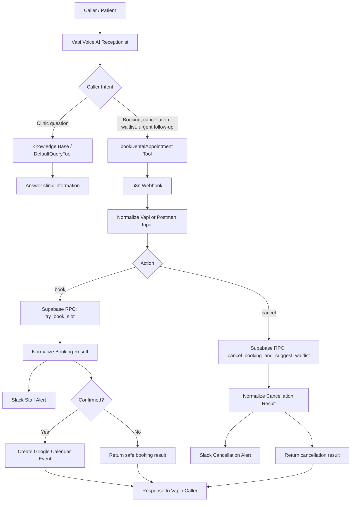

# Architecture

This document explains how the **BrightSmile AI Receptionist** system works from caller request to backend decision, staff notification, calendar creation, and final response.

The goal of the architecture is simple:

> Let the AI receptionist handle common booking, cancellation, waitlist, and clinic information requests, while keeping Supabase as the source of truth and staff involved when uncertainty or follow-up is needed.

---

## Simplified System Flow

The simplified diagram below is the best high-level view of the project.


---

## High-Level Flow



---

## Main Components

### 1. Vapi Voice AI Receptionist

Vapi handles the live caller conversation.

It is responsible for:

- Asking the caller for missing details.
- Understanding whether the caller wants clinic information, booking, cancellation, waitlist, or urgent follow-up.
- Calling the correct tool.
- Speaking the final result back to the caller.

Vapi is **not** the source of truth for appointment availability. It only collects the information and calls the backend workflow.

---

### 2. DefaultQueryTool / Knowledge Base

The knowledge tool answers basic clinic questions such as:

- Opening hours
- Closed days
- Services
- Dentist schedules
- Basic clinic information

It should not be used to check live appointment availability or cancel appointments.

Live scheduling decisions are handled by Supabase through n8n.

---

### 3. bookDentalAppointment Tool

This is the main action tool used by Vapi.

It handles:

- Booking requests
- Cancellation requests
- Waitlist consent
- Urgent follow-up requests
- General staff follow-up requests

The tool sends structured data to the n8n webhook.

Example booking payload:

```json
{
  "action": "book",
  "patient_name": "Demo Patient",
  "patient_contact": "+252600000000",
  "service_code": "dental_cleaning",
  "requested_start_time": "2026-07-14T08:00:00+00:00",
  "urgency": "normal",
  "waitlist_consent": false
}
```

Example cancellation payload:

```json
{
  "action": "cancel",
  "booking_id": "example-booking-id",
  "patient_name": "Demo Patient",
  "patient_contact": "+252600000000",
  "service_code": "dental_cleaning",
  "requested_start_time": "2026-07-14T08:00:00+00:00",
  "cancelled_by": "patient_voice_call",
  "cancellation_reason": "Patient requested cancellation"
}
```

---

## n8n Workflow Design

n8n acts as the workflow orchestration layer.

It receives the request from Vapi or Postman, normalizes it, routes it, calls Supabase, sends alerts, creates calendar events, and returns the final result.

### n8n Node Flow

```text
Webhook
→ Normalize Vapi or Postman Input
→ Is Cancellation Action?
```

Booking branch:

```text
Call Supabase try_book_slot
→ Normalize Booking Result
→ Slack Booking Alert
→ Is Confirmed Booking?
   → If confirmed: Create Google Calendar Event
   → If not confirmed: Respond to Webhook
→ Respond to Webhook
```

Cancellation branch:

```text
Cancel booking and suggest waitlist
→ Normalize Cancellation Result
→ Slack Cancellation Alert
→ Respond to Webhook
```

---

## Booking Logic

The booking branch calls the Supabase RPC function:

```text
try_book_slot
```

This function checks:

- Whether the service code is valid.
- Whether the requested date is inside the allowed booking window.
- Whether the requested time matches the doctor’s schedule.
- Whether the slot overlaps with an existing confirmed booking.
- Whether the daily capacity limit has been reached.
- Whether the caller should be offered a waitlist option.
- Whether the booking can be confirmed.

Possible booking statuses:

| Status | Meaning |
|---|---|
| `confirmed` | Appointment was successfully booked |
| `unavailable` | Requested time or service schedule is not available |
| `waitlist_offer` | Slot is unavailable, but the caller can join the waitlist |
| `waitlisted` | Caller was added to the cancellation waitlist |
| `human_required` | Staff should verify the request |
| `invalid_input` | Required information is missing or invalid |

---

## Cancellation Logic

The cancellation branch calls the Supabase RPC function:

```text
cancel_booking_and_suggest_waitlist
```

This function checks:

- Whether the booking exists.
- Whether the booking is currently confirmed.
- Whether the booking has already been cancelled.
- Whether a matching waitlisted patient exists.
- Whether staff should be notified for follow-up.

Cancellation can happen by:

1. `booking_id`, which is safest when Vapi cancels an appointment it just booked in the same conversation.
2. Patient name, contact, service, and appointment time, which is useful for appointments that already existed before the call.

Possible cancellation statuses:

| Status | Meaning |
|---|---|
| `cancelled_no_waitlist_match` | Booking was cancelled and no matching waitlist patient was found |
| `cancelled_waitlist_recommended` | Booking was cancelled and a waitlisted patient was recommended for staff review |
| `cancel_not_found` | No matching confirmed booking was found |
| `already_cancelled` | The booking was already cancelled |
| `verification_required` | Staff should verify the final status |

---

## Waitlist Logic

The waitlist is intentionally human-in-the-loop.

The assistant cannot add someone to the waitlist unless the caller clearly agrees.

When a slot is unavailable:

1. The backend can return `waitlist_offer`.
2. The assistant asks whether the caller wants to join the cancellation waitlist.
3. If the caller agrees, Vapi calls the tool again with:

```json
{
  "waitlist_consent": true
}
```

When a confirmed booking is cancelled:

1. Supabase checks for a matching waitlisted patient.
2. The workflow recommends the waitlisted patient to staff.
3. Staff decides whether to contact or book the waitlisted patient.

The system does **not** automatically rebook waitlisted patients.

---

## Timezone Handling

The clinic speaks to callers in local time:

```text
Africa/Nairobi / UTC+03:00
```

The backend receives UTC timestamps:

```text
+00:00
```

Example:

```text
Caller says: Tuesday July 14 at 11:00 AM
Tool sends: 2026-07-14T08:00:00+00:00
```

This prevents ambiguity between voice conversation time and database time.

---

## Supporting Systems

### Supabase Database

Supabase stores:

- Bookings
- Waitlist entries
- Services
- Doctors
- Doctor availability
- Workflow logs

It is the source of truth for scheduling decisions.

---

### Slack Alerts

Slack keeps staff informed.

Alerts are sent for:

- Booking requests
- Confirmed bookings
- Waitlist activity
- Cancellation requests
- Waitlist recommendations
- Human verification cases

---

### Google Calendar

Google Calendar events are created only when the booking result is:

```text
status = confirmed
```

This prevents calendar pollution from failed, waitlisted, or uncertain requests.

---

## Reliability and Fallback Design

During local testing, the n8n Docker container occasionally had HTTPS connection errors when calling Supabase.

Example:

```text
ECONNREFUSED
```

To handle this, the Supabase Code nodes include retry logic.

If all retries fail, the workflow does not fake success. It returns a safe fallback status:

- `human_required` for booking
- `verification_required` for cancellation

This means the assistant can safely say staff will verify the request instead of pretending the appointment was booked or cancelled.

---

## Privacy and Prototype Boundaries

This project is a prototype workflow for demonstration purposes.

For public demos and screenshots:

- Use demo patients only.
- Do not expose real patient data.
- Do not expose real phone numbers or emails.
- Do not expose Supabase keys, Slack tokens, Google credentials, webhook secrets, or ngrok auth tokens.
- Blur or replace any sensitive data before publishing.

For real clinic use, healthcare privacy compliance such as HIPAA or local equivalents would require additional review around data storage, vendor agreements, access control, audit logs, and retention policies.

---

## Why This Architecture Works

The architecture is useful because each part has a clear responsibility:

| Component | Responsibility |
|---|---|
| Vapi | Conversation and structured tool calling |
| n8n | Workflow routing and integrations |
| Supabase | Scheduling source of truth |
| Slack | Staff visibility |
| Google Calendar | Confirmed appointment schedule |
| Human staff | Edge cases, waitlist follow-up, verification |

The result is a practical AI receptionist system that automates repetitive front-desk work while keeping humans involved where judgment or privacy matters.
